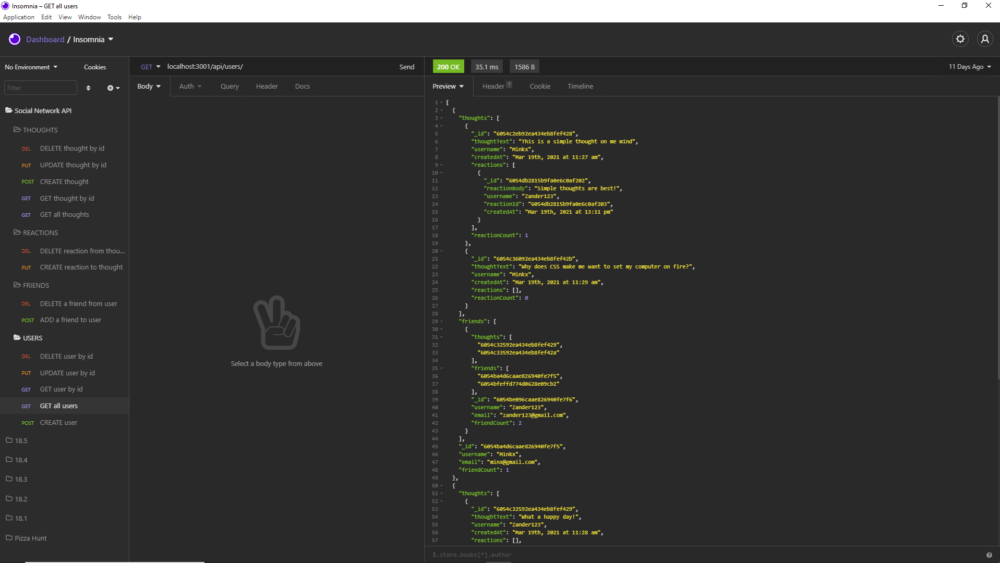

# NoSQL Challenge: Social Network API
  
  
### UCF Coding Boot-Camp Week 18 Challenge 

## Description
An API for a social network web application where users can share their thoughts, react to friend's thoughts, and create a friend list. This application is built utilizing MongoDB, Mongoose and Express.js.

## Table of Contents
- [Usage](#Usage)
- [Installation](#Installation)
- [Features](#Features)
- [Production](#Production)
- [Questions](#Questions)
- [Contribution](#Contribution)

## Installation
- Clone down the application code from GitHub.
- Please ensure you have a node.js integrated terminal. If not, download [Node](https://nodejs.org/en/).
- Inside root directory terminal, run 'npm init'.
- Inside root directory terminal, run 'npm install' to install application dependencies. 
- In a seperate terminal of project directory, run 'mongod' to initialize MongoDB server database.
- Inside root directory terminal, run 'npm start' to activate application.

## Usage
- Once server has been initialized by running 'npm start' in root directory of terminal:
- API routes can be tested on servers. As this is a back-end ONLY application, there will be no front end to display results. 
Instead, user will need to utilize an API test client to test out the API routes located in routes/api folder. 
- Developer utilized [Insomnia](https://insomnia.rest/download) as the API test client. 
- Please review video of application [demo](https://www.youtube.com/watch?v=6mb6I6CaAwc&ab_channel=Elysiayn).

## Features
- Utilize MongoDB and Mongoose instead of MySQL and Sequelize for the back-end of the server. 
- API routes in application are formatted in JSON.
- User will be able to retrieve API GET routes for users and thoughts.
- User will be able to test the API POST, PUT, and DELETE routes to affect database.

## Production

## Questions
Please feel free to reach out for additional questions at:
 
- Email: Elysiayn@gmail.com (Wendy Lemus)

 

### Contributions
Visit my GitHub!
- [Elysiayn](https://github.com/Elysiayn)
